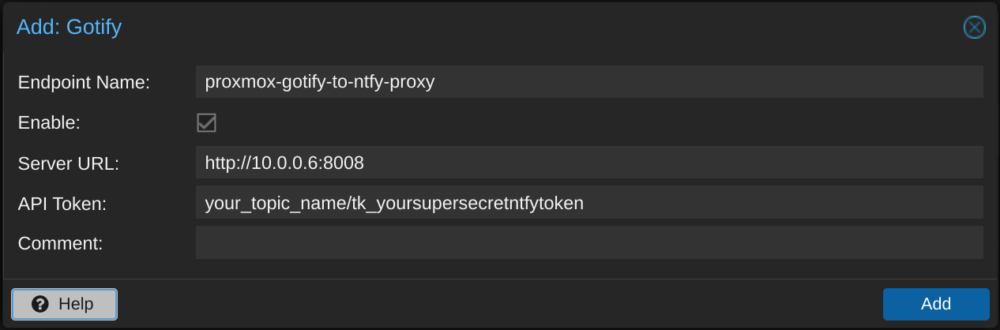

# Gotify to Ntfy Proxy

This is intended to be used with Proxmox v8+ to get Ntfy integration with the "new" notification system. At time of writing there is no native Ntfy integration in Proxmox.

## Proxmox settings
Go to Datacenter > Notifications > Add > Gotify

In this example the proxy is running on "http://10.0.0.6:8008" topic on Ntfy is "your_topic_name" and the ntfy token is "tk_yoursupersecretntfytoken".



After adding the proxy create a "Notification Matcher" or edit the default one.
The proxy also works with Proxmox Backup Server since it uses the same notification system as Proxmox.


## Example .env file

The protocol part of the NTFY_SEVER variable is mandatory!

```env
NODE_ENV=production

RELAY_HOST_IP=0.0.0.0
RELAY_PORT=8008

NTFY_SERVER=https://ntfy.sh
```

## Example topic.js file
```javascript
const topics = {
  you_topic_name_one: {
    ntfyToken: 'tk_yoursupersecretntfytoken'
  },
  you_topic_name_two: {
    ntfyToken: 'tk_yoursupersecretntfytoken'
  },
}

module.exports = topics
```

## Local development container

```bash
docker build -f Dockerfile-dev -t gotify-to-ntfy-proxy:dev .

docker run --rm -it -v $(pwd):/home/node/app \
  -e TZ=Europe/Berlin \
  -e NODE_ENV=development \
  -e RELAY_HOST_IP=0.0.0.0 \
  -e NTFY_SERVER=https://ntfy.sh \
  -p 8008:8008 \
  gotify-to-ntfy-proxy:dev /bin/sh
```

## Docker container / deployment

IMPORTANT: If you are using docker container names to route between containers make sure you still use the protocol "http://" in front of the container name. Otherwise it wont work. e.g. NTFY_SERVER=http://ntfy_container_name

```bash
docker run \
  --user "$(id -u):$(id -g)" \ # This will run the process as the current user
  -p 8008:8008 \
  -v /path/to/your/.env:/home/node/app/.env:ro \
  -v /path/to/your/topics.js:/home/node/app/topics.js:ro \
  --restart unless-stopped \
  levantinlynx/gotify-to-ntfy-proxy:latest
```

Optionally you can also pass the environment variables instead of using the .env file or use docker compose.

```docker
services:
  gotify-to-ntfy-proxy:
    image: 'levantinlynx/gotify-to-ntfy-proxy:latest'
    restart: unless-stopped
    # Change this to the desired user. (Current user IDs get be found be running "id -u" and "id -g")
    # No user:group will result in execution as root
    user: "1000:1000"
    volumes:
      - '/path/to/your/topics.js:/home/node/app/topics.js:ro'
    ports:
      - '8008:8008'
    environment:
      - RELAY_HOST_IP=0.0.0.0
      - RELAY_PORT=8008
      - NTFY_SERVER=https://ntfy.sh
```

If no environment file or variables are provided, the service will start with the following default values:

```env
NODE_ENV=production
RELAY_HOST_IP=0.0.0.0
RELAY_PORT=8008
NTFY_SERVER=https://ntfy.sh
```

## ntfy for iOS now supports attachments

Long notification text will be converted into a txt attachment. (This is ntfy server behaviour.)

---

# Credits

Thank you to all the contributers of [Gotify](https://github.com/gotify/server) and [Ntfy](https://github.com/binwiederhier/ntfy) for creating and maintaining such amazing and usefull software.

# Logo

The gotify-to-ntfy-proxy logo is licensed under the [Creative Commons Attribution 4.0 International Public License](http://creativecommons.org/licenses/by/4.0/).

### Gotify

The Gotify logo is licensed under the [Creative Commons Attribution 4.0 International Public License](http://creativecommons.org/licenses/by/4.0/). The original Go gopher was designed by Renee French (http://reneefrench.blogspot.com/).